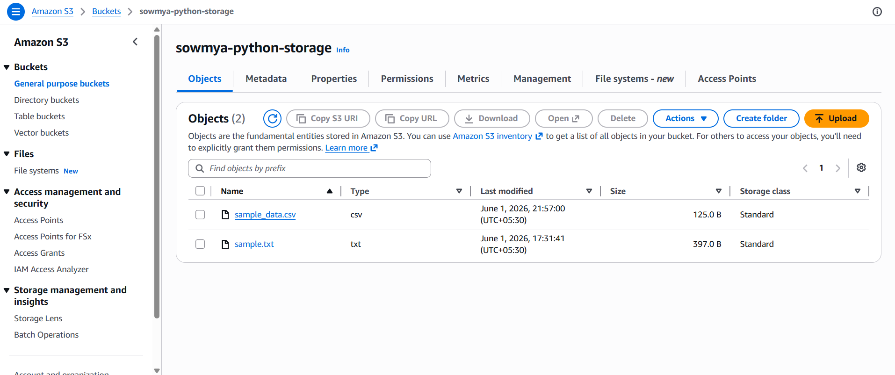
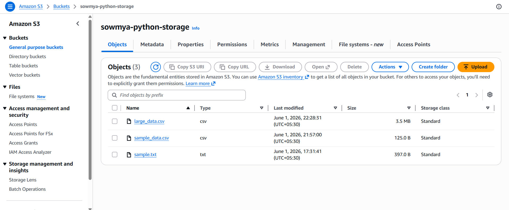

# Part 3: Python + Boto3 – Data Transfer

## Objective

The objective of this task is to use Python and the Boto3 SDK to interact with Amazon S3. The task demonstrates uploading files to S3, downloading files from S3, handling common exceptions, verifying file integrity, and listing bucket contents.

---

# Prerequisites

- AWS Account
- IAM User with S3 permissions
- AWS CLI configured
- Python 3.x installed
- Boto3 library installed
- Existing S3 Bucket

---

# Task A: Local to S3 Upload

## Creating Sample CSV File

A sample CSV file was created to simulate customer data.

### File

```text
data/sample_data.csv
```

### Purpose

Used for testing file uploads to Amazon S3.

---

## Uploading CSV File to S3

A Python script was created using Boto3 to upload the CSV file from the local system to an S3 bucket.

### Script

```text
scripts/upload_csv_to_s3.py
```

### Functionality

- Connects to Amazon S3
- Uploads local CSV file
- Displays success message upon completion

### Screenshot



---

## Creating Large CSV File

A large CSV dataset was generated to simulate bulk data transfer.

### Script

```text
scripts/generate_large_csv.py
```

### Generated File

```text
data/large_data.csv
```

### Purpose

Used to demonstrate large file uploads to Amazon S3.

---

## Uploading Large CSV File

A Python script was created to upload the generated large CSV file to Amazon S3.

### Script

```text
scripts/upload_large_file.py
```

### Functionality

- Connects to Amazon S3
- Uploads large CSV file
- Confirms successful upload

### Screenshot



---

## Error Handling

### File Not Found Error

Implemented exception handling for situations where the specified file path does not exist.

### Exception

```python
FileNotFoundError
```

### Purpose

Prevents program crashes and provides meaningful error messages.

---

### Invalid Credentials Error

Implemented exception handling for invalid or missing AWS credentials.

### Exception

```python
NoCredentialsError
```

### Purpose

Ensures users are notified when AWS credentials are not configured correctly.

---

# Task B: S3 to Local Download

## Downloading File from S3

A Python script was developed to download files from Amazon S3 to the local system.

### Script

```text
scripts/download_from_s3.py
```

### Functionality

- Connects to S3
- Downloads specified file
- Stores file in local downloads folder

### Screenshot


---

## Verifying File Integrity

File integrity was verified using SHA-256 hashing.

### Script

```text
scripts/verify_file_integrity.py
```

### Process

1. Calculate hash of original file.
2. Calculate hash of downloaded file.
3. Compare both hashes.

### Result

If hashes match, the downloaded file is identical to the original file.

### Benefits

- Ensures data consistency.
- Detects file corruption.
- Validates successful transfers.

---

## Listing Files in S3 Bucket

A Python script was created to list all objects stored in the S3 bucket.

### Script

```text
scripts/list_s3_files.py
```

### Functionality

- Retrieves all bucket objects.
- Displays object names.
- Helps verify uploads and bucket contents.

---

# Concepts Learned

## What is Boto3?

Boto3 is the official AWS SDK for Python.

It allows Python applications to interact with AWS services such as:

- Amazon S3
- Amazon EC2
- Amazon DynamoDB
- Amazon RDS
- AWS Lambda

---

## Why Use Boto3?

### Advantages

- Simplifies AWS automation
- Easy integration with Python
- Supports all AWS services
- Secure credential management

---

## What is Amazon S3?

Amazon Simple Storage Service (S3) is AWS object storage.

### Features

- Highly scalable
- Highly durable
- Secure storage
- Easy integration with applications

---

## Why Verify File Integrity?

File integrity verification ensures that downloaded files are exactly the same as the original uploaded files.

### Common Methods

- MD5 Hash
- SHA-256 Hash

### Benefits

- Detects corruption
- Ensures reliability
- Confirms successful transfers

---

# Outcome

Successfully completed Python and Boto3 based data transfer operations by:

- Uploading a small CSV file to Amazon S3
- Uploading a large CSV file to Amazon S3
- Handling file-related exceptions
- Handling AWS credential errors
- Downloading files from Amazon S3
- Verifying file integrity using SHA-256 hashing
- Listing files stored in an S3 bucket

This task demonstrated practical integration between Python applications and AWS cloud storage services using Boto3.
